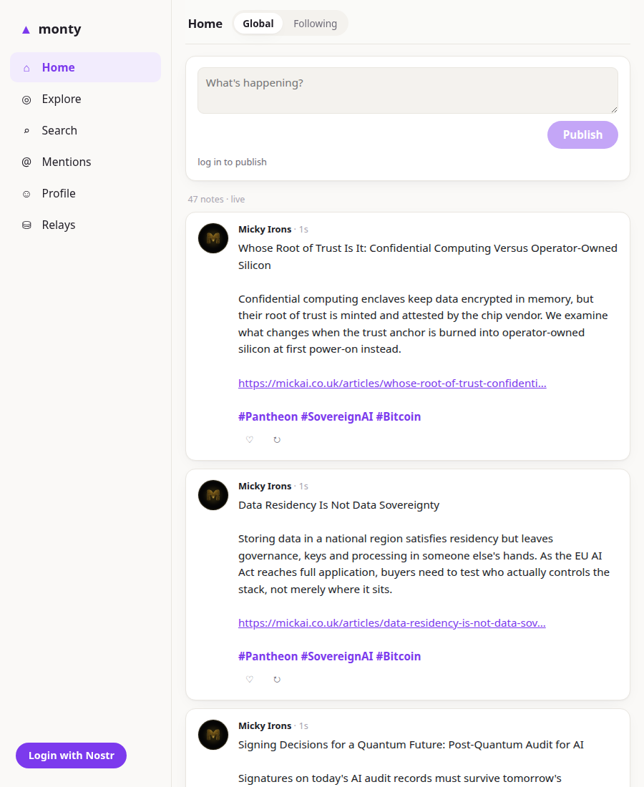

# monty

**The full monty.** Everything nostr-client has, in one client — and still one
buildless HTML file.

**Live:** https://nostr-client.github.io/monty/

- **Home** — global firehose or your follows, composer on top
- **Explore** — browse individual relays' feeds (jumble-style), or paste your own
- **Search** — NIP-50 full-text
- **Mentions** — replies, reposts, reactions to you, live
- **Threads** — full NIP-10 conversations with reply box; `#note/<hex>` permalinks
- **People** — in-app profile pages (`#person/<hex>`) with follow + on-chain
  **₿ tip** buttons; clicking any `@mention` routes here
- **Hashtags** — click any `#tag` for its feed (`#tag/<word>`)
- **Relays** — manage the shared pool, load/publish NIP-65
- **Hardened** — every event schnorr-verified, everything cached in IndexedDB

## The grades

| grade | client | character |
|---|---|---|
| minimal | [zen](https://nostr-client.github.io/zen/) | read only, serene |
| daily | [micro](https://nostr-client.github.io/micro/) | the essentials |
| full | **monty** | everything |

All three are thin HTML files over the same
[parts](https://nostr-client.github.io/) — the diff between grades is which
components the page imports and how it routes between them. Fork this file
and delete what you don't want; that's the whole customization story.

## License

AGPL-3.0-or-later
